# multi-cloud-terragrunt-filesystem

A common complaint about Terragrunt is organizations must adopt a strictly enforced paradigm that breaks their ability to customize their repository layouts. The reality is Terragrunt can be laid out exactly how your teams see fit.

This repository demonstrates the use of Terragrunt in managing a hierarchical, multi-cloud infrastructure, aligning with the structural organization of different cloud providers. Terragrunt effectively mirrors the structural hierarchy of cloud providers such as AWS and GCP. For instance, AWS organizes resources in the order of Organizations, Organizational Units (OUs), child OUs, and so forth, which can be aptly mirrored using Terragrunt. This adequate mirroring of cloud structure enhances the organization and readability of infrastructure code.

## Structure

The directory structure is systematically aligned to mirror the cloud setup:



```shell
.
├── LICENSE
├── README.md
├── aws
│   ├── README.md
│   ├── organization
│   │   ├── account_factory
│   │   │   ├── account_factory.hcl
│   │   │   └── terragrunt.hcl
│   │   ├── organization.hcl
│   │   └── scps
│   │       ├── scps.hcl
│   │       └── terragrunt.hcl
│   ├── providers.hcl
│   ├── security-ou
│   │   ├── audit
│   │   │   └── account.hcl
│   │   └── security-tooling
│   │       └── account.hcl
│   └── workloads-ou
│       ├── development
│       │   ├── account.hcl
│       │   └── us-west-2
│       │       ├── region.hcl
│       │       ├── team-a
│       │       │   ├── aurora
│       │       │   │   └── terragrunt.hcl
│       │       │   ├── eks
│       │       │   │   └── terragrunt.hcl
│       │       │   ├── team-values.hcl
│       │       │   └── vpc
│       │       │       └── terragrunt.hcl
│       │       └── team-b
│       │           ├── aurora
│       │           │   └── terragrunt.hcl
│       │           ├── eks
│       │           │   └── terragrunt.hcl
│       │           ├── team-values.hcl
│       │           └── vpc
│       │               └── terragrunt.hcl
│       ├── ou.hcl
│       └── production
│           ├── account.hcl
│           └── us-east-1
│               ├── region.hcl
│               ├── team-a
│               │   ├── aurora
│               │   │   └── terragrunt.hcl
│               │   ├── eks
│               │   │   └── terragrunt.hcl
│               │   ├── team-values.hcl
│               │   └── vpc
│               │       └── terragrunt.hcl
│               └── team-b
│                   ├── aurora
│                   │   └── terragrunt.hcl
│                   ├── eks
│                   │   └── terragrunt.hcl
│                   ├── team-values.hcl
│                   └── vpc
│                       └── terragrunt.hcl
├── azure
│   ├── ai_management_group
│   │   └── thinkum_subscription
│   │       ├── data_resource_group
│   │       │   └── resource_group.hcl
│   │       ├── subscription.hcl
│   │       └── ui_resource_group
│   │           └── resource_group.hcl
│   ├── providers.hcl
│   └── tech_management_group
│       ├── baller_subscription
│       │   ├── subscription.hcl
│       │   ├── team-a-resource-group
│       │   │   ├── ake
│       │   │   │   └── terragrunt.hcl
│       │   │   ├── cosmos
│       │   │   │   └── terragrunt.hcl
│       │   │   ├── resource-group.hcl
│       │   │   └── vnet
│       │   │       └── terragrunt.hcl
│       │   └── team-b-resource-group
│       │       ├── ake
│       │       │   └── terragrunt.hcl
│       │       ├── cosmos
│       │       │   └── terragrunt.hcl
│       │       ├── resource-group.hcl
│       │       └── vnet
│       │           └── terragrunt.hcl
│       ├── gates_subscription
│       │   ├── subscription.hcl
│       │   ├── team-a
│       │   │   ├── ake
│       │   │   │   └── terragrunt.hcl
│       │   │   ├── cosmos
│       │   │   │   └── terragrunt.hcl
│       │   │   ├── team-values.hcl
│       │   │   └── vnet
│       │   │       └── terragrunt.hcl
│       │   └── team-b
│       │       ├── ake
│       │       │   └── terragrunt.hcl
│       │       ├── cosmos
│       │       │   └── terragrunt.hcl
│       │       ├── team-values.hcl
│       │       └── vnet
│       │           └── terragrunt.hcl
│       └── management_group.hcl
├── gcp
│   ├── README.md
│   ├── dba-projects
│   │   ├── project-alpha
│   │   │   └── project.hcl
│   │   ├── project-beta
│   │   │   └── project.hcl
│   │   ├── project-delta
│   │   │   ├── project.hcl
│   │   │   └── uint-overflow
│   │   │       ├── cloud-sql
│   │   │       │   └── terragrunt.hcl
│   │   │       ├── current.hcl
│   │   │       └── vpc
│   │   │           └── terragrunt.hcl
│   │   └── project-folder.hcl
│   ├── providers.hcl
│   └── sre-projects
│       ├── project-folder.hcl
│       └── project-o11y
│           ├── grafana
│           │   ├── aws-data
│           │   │   ├── README.md
│           │   │   └── terragrunt.hcl
│           │   ├── current.hcl
│           │   └── vpc
│           │       └── terragrunt.hcl
│           └── project.hcl
└── terragrunt.hcl

65 directories, 71 files

```

## Usage

Running all configurations is achieved with `terragrunt run-all apply`, executing modules based on Terragrunt-determined dependency order:

```shell
(base) ~/tf/multi-cloud-terragrunt-filesystem 0 $ gcloud auth application-default login
(base) ~/tf/multi-cloud-terragrunt-filesystem 0 $ aws-vault exec iangrunt-sandbox -- terragrunt run-all plan
INFO[0000] The stack at /Users/gruntwork/tf/multi-cloud-terragrunt-filesystem will be processed in the following order for command plan:
Group 1
- Module /Users/gruntwork/tf/multi-cloud-terragrunt-filesystem/aws/workloads-ou/development/us-west-2/team-a/vpc
- Module /Users/gruntwork/tf/multi-cloud-terragrunt-filesystem/aws/workloads-ou/development/us-west-2/team-b/vpc
- Module /Users/gruntwork/tf/multi-cloud-terragrunt-filesystem/aws/workloads-ou/production/us-east-1/team-a/vpc
- Module /Users/gruntwork/tf/multi-cloud-terragrunt-filesystem/aws/workloads-ou/production/us-east-1/team-b/vpc
- Module /Users/gruntwork/tf/multi-cloud-terragrunt-filesystem/gcp/dba-projects/project-delta/int-overflow/vpc
- Module /Users/gruntwork/tf/multi-cloud-terragrunt-filesystem/gcp/sre-projects/project-o11y/grafana/vpc

Group 2
- Module /Users/gruntwork/tf/multi-cloud-terragrunt-filesystem/aws/workloads-ou/development/us-west-2/team-a/aurora
- Module /Users/gruntwork/tf/multi-cloud-terragrunt-filesystem/aws/workloads-ou/development/us-west-2/team-a/eks
- Module /Users/gruntwork/tf/multi-cloud-terragrunt-filesystem/aws/workloads-ou/development/us-west-2/team-b/aurora
- Module /Users/gruntwork/tf/multi-cloud-terragrunt-filesystem/aws/workloads-ou/development/us-west-2/team-b/eks
- Module /Users/gruntwork/tf/multi-cloud-terragrunt-filesystem/aws/workloads-ou/production/us-east-1/team-a/aurora
- Module /Users/gruntwork/tf/multi-cloud-terragrunt-filesystem/aws/workloads-ou/production/us-east-1/team-a/eks
- Module /Users/gruntwork/tf/multi-cloud-terragrunt-filesystem/aws/workloads-ou/production/us-east-1/team-b/aurora
- Module /Users/gruntwork/tf/multi-cloud-terragrunt-filesystem/aws/workloads-ou/production/us-east-1/team-b/eks
- Module /Users/gruntwork/tf/multi-cloud-terragrunt-filesystem/gcp/sre-projects/project-o11y/grafana/aws-data
```

The execution order is critical as it accounts for dependencies between configurations. For instance, within the first group, AWS and GCP resources are simultaneously processed because the GCP project relies on a value generated by the AWS VPC. Next, in the second group, the AWS EKS cluster and the GCP AWS data are executed simultaneously, as the EKS cluster also depends on the AWS VPC.

## Terragrunt Key Features

1. **DRY Infrastructure Code:** Terragrunt's HCL files promote DRY (Don't Repeat Yourself) code, defining infrastructure once for reuse across environments.
2. **Multi-Cloud Support:** Manage resources across multiple cloud providers from one place using this repository's structure.
3. **Shared Configurations:** Reduce repetition with Terragrunt's `include` block, enabling shared configurations across multiple Terragrunt modules.
4. **Automated Dependency Management:** Terragrunt automatically identifies and applies dependencies in the correct order.
5. **Enforced Standards:** A consistent naming standard is enforceable across the organization by structuring the repository to mirror the cloud providers' organizational structure.

## Cross-Cloud Interactions

Cross-cloud interactions, as needed in specific scenarios, are well-facilitated by Terragrunt. This repository features an example of interactions between Google Cloud Platform (GCP) and Amazon Web Services (AWS) under the `project-delta` of the `sre-projects` directory. The specific configuration can be found [here](https://github.com/iangrunt/multi-cloud-terragrunt-filesystem/tree/main/gcp/sre-projects/project-delta/iangrunt/aws-data).

## Collaborating with Gruntwork

Gruntwork is a DevOps solution that complements Terragrunt, offering robust infrastructure components. This repository is maintained by the Gruntwork sales team (sales@gruntwork.io).
